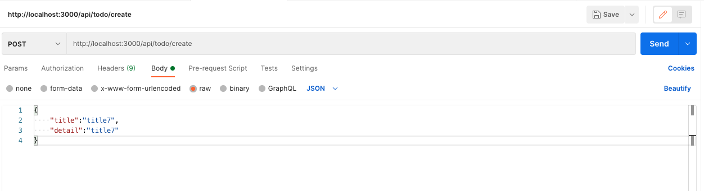

# SetUp TypeORM

## Install TypeORM

``` bash
yarn global add typeorm
```

## Generate First Models

``` bash
cd <project path>
typeorm init --database postgres
```

## Config Typescript

เปลี่ยน `tsconfig.json`

``` json
{
   "compilerOptions": {
      "allowJs": true,
      "alwaysStrict": true,
      "esModuleInterop": true,
      "forceConsistentCasingInFileNames": true,
      "isolatedModules": true,
      "jsx": "preserve",
      "lib": [
         "es5",
         "es6"
      ],
      "target": "es5",
      "module": "esnext",
      "moduleResolution": "node",
      "outDir": "./build",
      "emitDecoratorMetadata": true,
      "experimentalDecorators": true,
      "sourceMap": true,
      "noEmit": true,
      "noFallthroughCasesInSwitch": true,
      "noUnusedLocals": true,
      "noUnusedParameters": true,
      "resolveJsonModule": true,
      "skipLibCheck": true,
   },
   "exclude": [
      "node_modules",
      "_actions",
      "_PipelineMapping",
      "_tool",
      "actions-runner"
   ],
   "include": [
      "**/*.ts",
      "**/*.tsx"
   ]
}
```

Config Database Connection

``` json
{
    "type": "postgres",
    "host": "localhost",
    "port": 5432,
    "username": "demo",
    "password": "123456",
    "database": "testnextauth",
    "synchronize": true,
    "logging": false,
    "entities": [
        "src/entity/**/*.ts"
    ],
    "migrations": [
        "src/migrations/**/*.ts"
    ],
    "subscribers": [
        "src/subscribers/**/*.ts"
    ],
    "cli": {
        "entitiesDir": "src/entity",
        "migrationsDir": "src/migration",
        "subscribersDir": "src/subscriber"
    }
}
```

## ทดสอบสร้าง model

เพิ่มไฟล์ `.env`

``` bash
POSTGRES_PASSWORD=123456
POSTGRES_USER=postgres
POSTGRES_DB=demo
POSTGRES_HOST=localhost
POSTGRES_PORT=5432
```

เพิ่มไฟล์ `src/entity/todo.ts` เพื่อสร้าง model ของ todo

``` typescript
import { Column, Entity, Index, PrimaryGeneratedColumn } from "typeorm";
export enum TodoStatus {
  DONE = 'done',
  PENDING = 'pending',
  DELETE = 'delete'
}
@Index("name", ["title"], { unique: true })
@Index("todos_pkey", ["id"], { unique: true })
@Entity("todos", { schema: "public" })
export class Todos {
  @PrimaryGeneratedColumn({ type: "bigint", name: 'id' })
  id: number

  @Column("character varying", { name: "title", length: 255 })
  title: string

  @Column("character varying", { name: "detail", nullable: true })
  detail: string | null

  @Column({ type: "enum", enum: TodoStatus, name: "status", default: TodoStatus.PENDING })
  status: TodoStatus

  @Column("timestamp with time zone", {
    name: "created_at",
    default: () => "CURRENT_TIMESTAMP",
  })
  createdAt: Date;

  @Column("timestamp with time zone", {
    name: "updated_at",
    default: () => "CURRENT_TIMESTAMP",
  })
  updatedAt: Date;
}
```

สร้าง `src/utils/db.ts` เพื่อต่อ Database

``` typescript

import { Todos } from '../entity/todo'
import { Connection, ConnectionManager, ConnectionOptions, createConnection, getConnectionManager } from "typeorm";

export class Database {
  private connectionManager: ConnectionManager;

  constructor() {
    this.connectionManager = getConnectionManager();
  }

  public async getConnection(name: string): Promise<Connection> {
    const CONNECTION_NAME: string = name;
    let connection: Connection;
    const hasConnection = this.connectionManager.has(CONNECTION_NAME);
    if (hasConnection) {
      connection = this.connectionManager.get(CONNECTION_NAME);
      if (!connection.isConnected) {
        connection = await connection.connect();
      }
    } else {

      const connectionOptions: ConnectionOptions = {
        name: "default",
        type: "postgres",
        host: process.env.POSTGRES_HOST as string,
        port: parseInt(process.env.POSTGRES_PORT as string),
        username: process.env.POSTGRES_USER as string,
        password: process.env.POSTGRES_PASSWORD as string,
        database: process.env.POSTGRES_DB as string,
        entities: [Todos],
        synchronize: false,
        migrationsRun: true,
        logging: false,
        migrations: ['src/migration/**/*.ts'],
        subscribers: ['src/subscriber/**/*.ts'],
      };
      connection = await createConnection(connectionOptions);
    }
    return connection;
  }
}
```

สร้าง `pages/api/todo/create.ts` สร้าง api เพื่อทดสอบ Insert Database

``` typescript
import { NextApiRequest, NextApiResponse } from 'next'
interface DataProps {

}
import "reflect-metadata"
import { Todos } from '../../../src/entity/todo';
import { Database } from '../../../src/utils/db';
export default async (req: NextApiRequest, res: NextApiResponse<DataProps>) => {
  if (req.method === 'POST') {
    const db = new Database()
    const conn = await db.getConnection("default")
    try {
      const todoRepo = conn.getRepository(Todos)
      const { title, detail } = req.body

      const user = await todoRepo.insert({
        title,
        detail
      })
      res.send({
        code: 200,
        data: user
      })
    } catch (error) {
      res.send({
        code: 500,
        message: error
      })
    }
  } else {
    res.send({
      code: 500,
      message: "Internal Server Error."
    })
  }
}
```

ทดสอบ ส่งข้อมูล



## Document TypeORM

TypeORM : [Documents](https://typeorm.io/)
